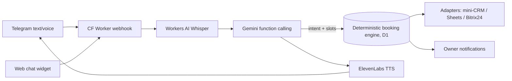

# Aiym — AI receptionist

**[Live demo](https://aiym.faizov-midat.workers.dev/demo)** · **[Landing](https://aiym.faizov-midat.workers.dev/landing)** · Telegram bot `@aiym_admin_bot` · Video: _coming with the first deployment_

A virtual receptionist for small businesses in Kazakhstan (salons, clinics, auto services). A client writes — or sends a **voice note** — *"book me for 3pm tomorrow"*. Aiym answers in text and voice, quotes prices, offers open slots, books the appointment and notifies the owner. Runs at **$0/month** on free tiers.

## The one idea that matters

> **The LLM understands speech; a deterministic engine owns the calendar.**

Gemini only extracts intent and copies slots it was shown. Availability checks and writes happen exclusively in a deterministic booking engine on Cloudflare D1, guarded by a primary key on `booking_cells`. **Double-booking is impossible at the database level** — two concurrent bookings for the same master and time resolve to exactly one row; the loser gets a conflict and alternatives. The LLM never decides who takes a slot.

## What it does

- **Answers 24/7** in Telegram (text + voice) and via a web chat widget.
- **Understands voice** — Whisper STT (auto-detects Russian and Kazakh); replies in voice via ElevenLabs.
- **Books, reschedules, cancels** through function calling, always validated against the real grid.
- **Qualifies leads** when the client isn't ready, and **hands off to a human** on complaints.
- **Pushes to CRM** — owner Telegram notification, Google Sheets, Bitrix24 (adapters).
- **Multi-tenant** — one Worker serves many businesses, each with its own bot token and admin panel.

## Try it in 60 seconds

1. Open the **[live demo](https://aiym.faizov-midat.workers.dev/demo)**.
2. Click a chip like *"Запишите меня завтра на 15:00 на маникюр"*.
3. Give a name — watch the booking appear in the live grid on the right within 3 seconds.
4. Try *"перенесите на час позже"* to see a reschedule.

The demo writes real rows to the database and resets every night.

## Architecture



## Engineering highlights

1. **LLM proposes, code disposes.** A double anti-hallucination lock: the tool dispatcher only accepts a `slot_start` that appeared in the last `checkFreeSlots` response, and the engine independently re-validates it against the pure grid before writing. Occupancy is decided solely by the `booking_cells` PK; only that specific constraint violation reads as "busy" — every other error is re-thrown, never silently treated as a conflict.
2. **A voice pipeline that lives on free tiers.** Whisper STT (base64, `vad_filter`), ElevenLabs TTS with a KV cache keyed by `sha256(text+voice)`, a 5/day uncached cap and a monthly credit counter. No key? The whole text path still works — voice degrades silently.
3. **Multi-tenant with pluggable CRM.** One Worker, a `businesses` table, per-tenant webhook paths, and a fan-out adapter interface where any adapter failure is isolated and never affects the client's reply.
4. **Quota-aware by design.** Every counter lives in D1 (KV free tier is 1000 writes/day). Each limit — 20 messages/day per chat, 5 voice, 300 global, 100 Whisper, 5 uncached TTS — degrades to a prepared polite phrase, never silence. If Gemini is down, a deterministic fallback still offers tomorrow's free slots.

## Cost — $0 / month

| Component | Tier | Headroom for the demo |
|---|---|---|
| Cloudflare Workers + D1 + KV | Free | Well within limits |
| Workers AI (Whisper STT) | Free (10k neurons/day) | ~214 min audio/day |
| Gemini `gemini-3.1-flash-lite` | Free | Covers demo traffic |
| ElevenLabs TTS | Free (10k credits/month) | Cached + capped |
| Turnstile (web widget) | Free | — |

## Tests

Real D1 in `workerd` via `@cloudflare/vitest-pool-workers` — the sacred principle is verified, not mocked.

```bash
npm test            # 57 tests: time, slots, booking (incl. concurrent double-book), tools, tts, crm
npm run typecheck   # tsc --noEmit
GEMINI_API_KEY=... npm run test:dates   # 15-phrase date-eval through real Gemini (not in CI)
```

The concurrency test fires two `book()` calls at the same slot and asserts exactly one row survives; the date-eval scores 15/15 on natural-language dates ("к трём" → 15:00, out-of-window → explains the limit).

## Onboarding a real salon

```bash
cp launch/salon-example.json my-salon.json   # edit hours, masters, services
npm run onboard my-salon.json --apply         # validates, writes rows, prints the admin token
```

Real tenants get `is_demo = 0` (the nightly reset never touches them) and **LIVE limits**
by default (80 messages/client/day, 5 upcoming bookings); the demo keeps tight caps.
Per-tenant overrides live in `businesses.limits` JSON.

## Health & monitoring

`GET /api/health` returns a JSON report (D1 reachable, secrets present, Turnstile live,
free-tier headroom) — `200` when healthy, `503` on failure, never a secret value. The
nightly cron re-runs it after the demo reset and pings the owner in Telegram **only** when
something is wrong.

## Roadmap

WhatsApp Cloud API · amoCRM OAuth · Gemini TTS (when it leaves preview) · realtime telephony (SIP/Twilio) · multi-location networks · online prepayment.

## Stack

Cloudflare Workers · D1 · KV · Workers AI (Whisper) · Gemini function calling · ElevenLabs · TypeScript, **zero runtime dependencies**.

## Author

Midat Faizov · [github.com/midat-fx](https://github.com/midat-fx)
